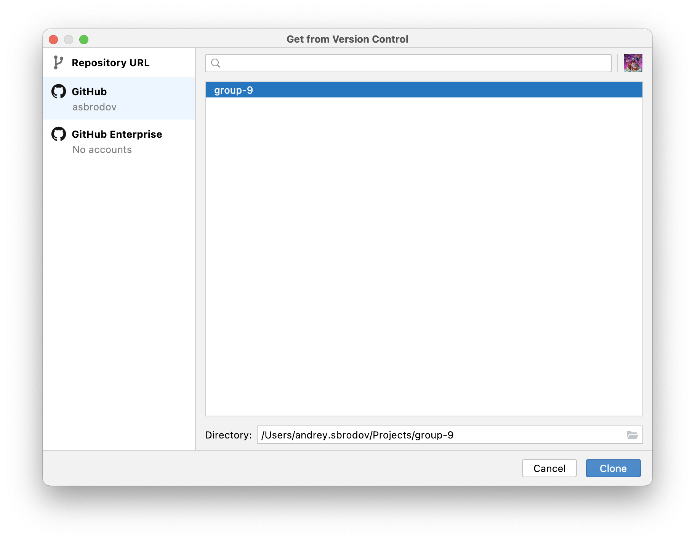
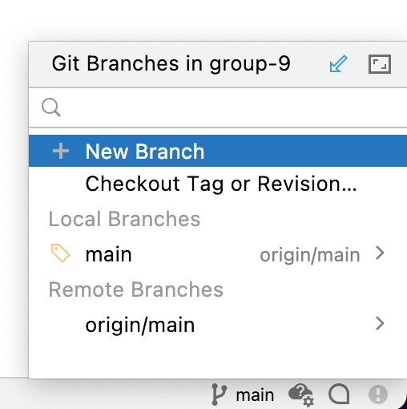
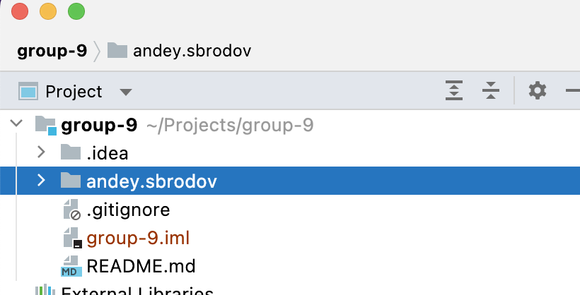
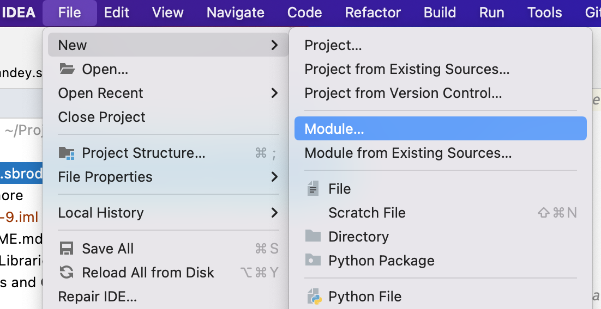
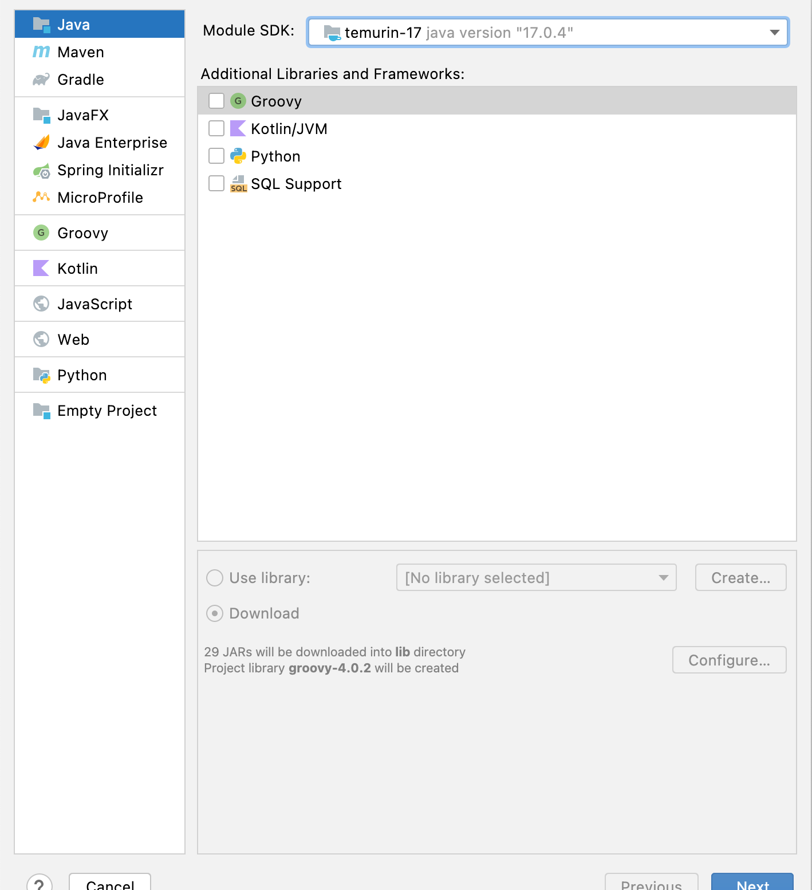
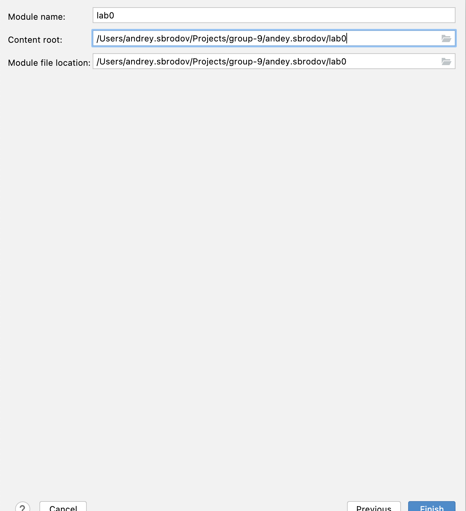
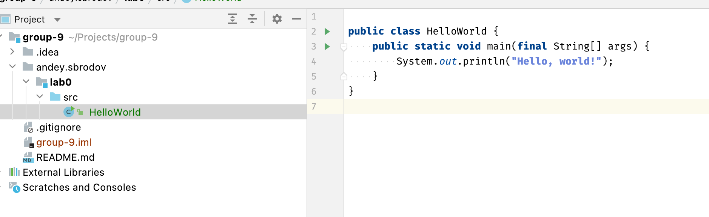
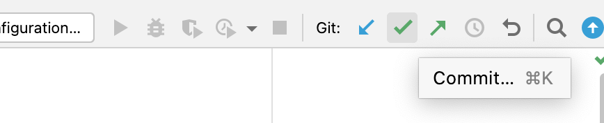
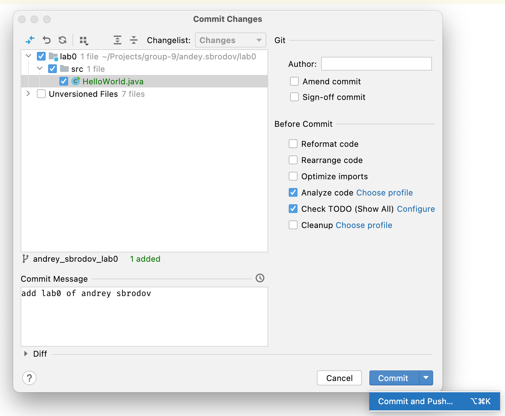
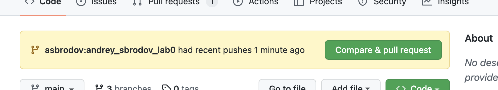

> Группа 91

Если вы видите этот текст, значит вы уже нашли этот репозиторий. Дальнейшая работа будет проводиться в нем.

# Следуйте инструкции

### 1. Создайте аккаунт на [GitHub](https://github.com/signup).
Существующий тоже подойдёт.

### 2. Попросите добавить вас в список контрибьютеров репозитория

Откройте чат @TODO в телеграм.  

Отправьте сообщение:  
```#репозиторий : {номер_группы} : {имя фамилия} : {имя аккаунта}```  
Напимер:  
```#репозиторий : 9 : Андрей Сбродов : asbrodov```

Пока ждёте реакции на ваше сообщение, переходите к п.3.

### 3. Настройте рабочее окружение

Установите [JDK](https://adoptium.net/temurin/releases/).

Установите [GIT](https://git-scm.com/downloads) (опционально).

Установите [IntelliJ IDEA](https://www.jetbrains.com/idea/download/).  
_Community для задач этого семестра более чем достаточно._

### 4. Клонируйте репозиторий

_Приступайте к этому пункту, когда вы уже получили доступ к репозиторию (закончен пт.2)._

Запустите идею.

На экране приветствия выберите пункт `Get from VCS`.


Выполните вход в учётную запись GitHub.



Выберите репозиторий вашей группы и выполните `Clone`.  
Откроется проект группы и этот гайд.

### 5. Лабораторная работа 0
  
Для того, чтобы создать ветку в GIT, найдите в правом нижнем углу имя текущей ветки ("main").  
По клику на имя откроется меню, в котором нужно выбрать пункт "New Branch".  
Создайте ветку с именем: `имя_фамилия_lab0`



В корне проекта создайте папку в формате `имя.фамилия`.  
Добавляйте модули ваших лабораторных работ в эту папку.



Создайте новый **модуль**.



Не забудьте выбрать SDK.



Также проверьте, что модуль находится в вашей личной папке. **По умочанию это не так**.



Выполните задание.



Найдите кнопку Commit.



В диалоге выберите Commit & Push. В следущем диалоге выполните Push.



В интерфейсе GitHub найдите плашку. Создайте Pull Request.



Ожидайте обратной связи.


